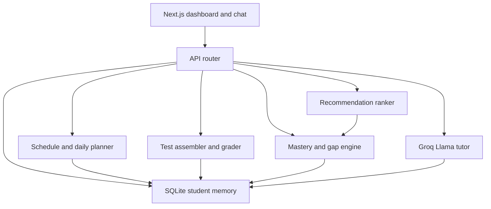

# JEE E-Tutor Prototype Plan

**Your choices:** chat-only v1, Groq (open Llama) for live tutoring. Voice stays a later add-on (browser STT/TTS + spoken-math rewrite), not in this prototype.

**Repo:** empty greenfield at `/Users/yatraduniya/Documents/ai-e-tutor`.

## Product scope (prototype)

- Audience: Class 11–12, Hyderabad, JEE Main + Advanced, 2-month program (8 weeks, IST).
- Subjects: Maths, Physics, Chemistry — **one chapter each**, taught in depth (not the full syllabus).
- Interface: logged-in student dashboard + text tutor chat + practice + weekly tests + end-of-day recap.
- Out of scope for v1: real voice, full 11–12 syllabus, parent/teacher roles, payment, mobile apps.

**Frozen prototype chapters (high-yield, Class 11 foundations):**

- Maths: Quadratic Equations
- Physics: Kinematics (1D / 2D)
- Chemistry: Atomic Structure

Each chapter is split into ~8 topics (concept → standard problems → JEE twists). The 8-week calendar is a **mastery loop** on these three chapters (teach, drill, Main mock, remediate, Advanced mock), not a survey of the whole JEE syllabus.

## Chat vs voice (decision already made)

| | Chat (v1) | Voice (later) |
|---|---|---|
| Fit | Best for formulas, options, stepwise solutions | Better for “talk while studying” |
| Cost/complexity | Low | Medium (mic permissions, STT errors on “emf”, “mole”, options A–D) |
| Math | Render KaTeX in chat | Must convert LaTeX to spoken English via a small rewrite pass |

v1 is **chat**. Architecture will keep tutor replies as structured text so a later TTS layer can attach without rewriting the planner.

## Multi-agent: do not build 7 running agents

Seven LangGraph agents (tutor, assessment, performance, gap, recommendation, memory, orchestrator) would add latency, cost, and debug surface for one student and three chapters. Those names are still useful as **modules**, not as independent LLM loops.

**Recommended shape: one request router + deterministic engines + one live LLM (tutor).**



What each “agent” becomes:

- **Orchestrator:** Next.js API routes (intent: chat / start-block / submit-answer / weekly-test / day-close). No LLM.
- **Memory:** SQLite tables + a short rolling chat summary **per topic**. No LLM except a periodic summary write. No global student transcript in the tutor prompt.
- **Assessment:** stratified random paper/practice draws + auto-grade (correctness + time). LLM only for *hints*, never for marks.
- **Performance / gap:** formulas on attempts. No LLM.
- **Recommendation:** ranked topic/question IDs from rules. LLM writes the “why this next” sentence.
- **Tutor:** the only always-on LLM. Each session is bound to **one topic (sub-course)**. Context card is that topic only (see below).

Live tutoring uses **one Groq call per student message**, not a chain of agents.

## Topic-scoped chat (sub-course context)

Chat is **not** a campus-wide tutor. It is one thread per **topic** (e.g. Physics / Kinematics / “Relative velocity”), not per chapter, not per day, not per student overall.

**Why:** Groq context stays small and on-syllabus. A “Nature of roots” thread must not see Atomic Structure lessons, other Quadratic topics, weekly-test keys, or yesterday’s Chemistry chat.

**How a thread is opened:** dashboard or today’s plan links to `/study/[topicId]`. Switching topic starts a **new** thread. There is no all-subjects chat box.

**What the packer puts in the LLM (only):**

- Topic identity: `subject`, `chapterId`, `topicId`, title.
- That topic’s lesson blob (objectives, one worked example, JEE traps) from `content/`.
- That student’s mastery **for this topic only** (one number + last few attempt flags).
- Last N messages **in this topic thread** (or the topic’s compressed summary + last few turns).
- At most the current practice item stem for this topic (not the official key).

**What is stripped (never in tutor context):**

- Other topics in the same chapter, other subjects, full question bank, paper keys, 8-week calendar, other students, day-close stats dumps, “today’s full plan” except a one-line “you are in this study block”.

**If the student asks off-topic** (another chapter, homework from a different block): tutor stays on this sub-course, points them to open that topic’s chat. It does not load the other lesson.

**Schema:** `ChatThread(userId, topicId)` unique; messages and optional `ChatSummary` keyed by thread. Recap/recommend-copy APIs stay global stats — they are **not** mixed into tutor prompts.

**Hints** during practice/test: same rule — hint prompt includes **only the current item’s topic lesson + stem**, never the rest of the paper.

## Deterministic scripts vs LLM

Full path map: **Folder hierarchy** and **What is LLM-driven** below. Summary here:

### Deterministic (code + frozen JSON). Must be scripts.

- Curriculum graph: chapter → topics → prerequisites → estimated minutes.
- 8-week calendar: odd weeks **JEE Main pattern** full-syllabus-of-prototype test; even weeks **JEE Advanced pattern**.
- Daily study-hour planner: split remaining minutes across weak topics; respect a student-set daily hour budget (default 4h).
- Study-block timer and “end of study hours” trigger.
- Question bank (frozen items + keys + `expectedSeconds` + difficulty/topic tags), marking scheme, negative marking.
- **Randomized** practice draws and **randomized** paper assembly (see below).
- Auto-grading: correctness (MCQ / numerical tolerance / multi-correct / integer / matching) **and** time-to-answer.
- Mastery per topic (includes speed), chapter coverage %, weak-topic ranking, spaced-repetition due list.
- Dashboard aggregations and per-user isolation.
- Auth/session.

**Randomized question bank and paper assembly (deterministic code, not LLM):**

- Bank is a **pool larger than any one paper**. Each item has `id`, subject, topic, type (`mcq_single` | `numerical` | `mcq_multi` | `integer` | `matching`), difficulty, `expectedSeconds`, key, optional option list.
- **Practice:** draw from eligible pool (topic + type), weighted toward gaps, **without recently seen IDs** (last N attempts for that user). Shuffle remaining options on MCQ each draw.
- **Weekly paper:** stratified random sample that still matches the Main/Adv **template counts** (e.g. Main: 6 single-correct + 2 numerical **per subject**). Constraints: cover at least K distinct topics per subject when the pool allows; do not reuse a question the same student already saw on a previous weekly test if alternatives exist.
- **Shuffle:** question order within each subject section; MCQ option order with a stored permutation so the key still grades.
- **Stable while in-progress:** `seed = hash(userId, weekNumber, attemptIndex)`. Regenerating the same attempt returns the same paper; a new attempt or another student gets a different draw.
- LLM never picks items or shuffles options.

**Time capture (every graded item, practice and test):**

- Persist `startedAt`, `submittedAt`, `timeMs` per question. Paper also has overall timer (auto-submit at duration).
- Unanswered at paper end: `timeMs` = remaining slot or full `expectedSeconds`; mark as unattempted (0, no negative if Main numerical-optional style; 0 for left MCQ, or Main negative only if marked — prototype: unattempted = 0).

**Grading (scripts only). Two numbers, both deterministic:**

1. **Pattern marks** (JEE-like): correctness + official negative marking. Shown as “Main/Adv score”. Time does not change this number (keeps the mock comparable to the exam).
2. **Time-aware grade** (used for mastery, recs, day-close, “how you performed”): start from pattern marks, then apply a speed factor from `timeMs` vs `expectedSeconds`.

```
timeRatio = timeMs / (expectedSeconds * 1000)
if correct:
  speedFactor = 1.0  if timeRatio <= 1.0
  speedFactor = lerp(1.0, 0.7, clamp((timeRatio - 1.0) / 1.0, 0, 1))  # full marks up to expected; taper to 70% if twice as slow
  timeAware = max(0, patternPositiveMarks) * speedFactor
if wrong:
  timeAware = patternMarks  # keep negative marking; do not extra-penalize slowness
  flag rushedGuess if timeRatio < 0.35
if unattempted:
  timeAware = 0
```

Dashboard shows both **pattern score** and **efficiency** (time-aware / max). Rushed wrongs feed gap analysis (“guessing”). Slow corrects feed “fluency gap” even if the mock marks are full.

**Mastery (example, implemented in code):**  
`0.35 * recent_accuracy + 0.20 * difficulty_weighted_accuracy + 0.20 * speed_efficiency + 0.15 * recency + 0.10 * consistency`  
Gap if mastery &lt; 0.6, last Main/Adv error on that topic, or repeated slow-correct / rushed-wrong on that topic.

**Daily planner (example):** remaining minutes today → fill from (1) due reviews (2) gaps (3) upcoming weekly-test weight (4) leftover new topics. Never let the LLM invent the timetable.

**Scaled weekly tests (prototype, all 3 subjects):**

- Main week (~45–60 min): per subject 6 single-correct + 2 numerical (answer-key graded).
- Advanced week (~60–75 min): per subject mix of 2 multi-correct + 1 integer + 1 matching/paragraph.

### Offline LLM authoring (build-time, then freeze in repo)

Use Groq once (or a script) to **draft** lessons and extra items, then commit reviewed JSON. Runtime must not generate official exam items.

- Topic lesson outlines (objectives, 1 worked example, 3 common JEE traps).
- Extra practice stems **only after** a human/dev pass; v1 ships a hand-authored **pool** (not a fixed paper). Runtime randomizes from the pool.

### Online LLM (runtime, Groq). Allowed to generate.

- Socratic tutoring and explanations **inside one topic thread** (context limited to that sub-course).
- Hints that do not leak the official key.
- Worked-solution *narration* from a stored solution (LLM restates; key stays in JSON).
- Daily achievement recap prose from a stats payload (`minutes`, `topics_done`, `accuracy`, `gaps_open`, `tomorrow_first_block`).
- Short “why we recommend X” copy for the ranked next item.

### LLM must not

- Invent official questions, pick paper items, shuffle keys, or assign marks.
- Pull another topic/chapter into the current chat context.
- Change the day’s hour plan or weekly test type.
- Recompute mastery.
- Claim JEE readiness without the numeric dashboard.

**Tutor system contract:** `{ topicId, lesson, masteryForTopic, threadMessages }` in; markdown + optional KaTeX out. Refuse to load other topics. If the student asks to skip the plan, tutor may encourage but the planner remains source of truth.

## App surfaces

1. **Login** — simple email/password or seeded demo students (`arun-demo`, `student-2`) so the dashboard is user-specific.
2. **Dashboard** — chapter coverage (3 chapters × topics), mastery heat, 8-week strip (Main/Adv badges), **today’s hour blocks**, streak, next weekly test.
3. **Study** — `/study/[topicId]` only: that sub-course’s lesson + **topic-scoped** tutor chat + “start practice” for this topic.
4. **Practice** — randomized draw from ranked pool; per-question timer; instant pattern + time-aware grade; tutor can hint.
5. **Weekly test** — timed paper assembled randomly from the week’s template; per-question and overall clocks; results by subject/topic with pattern score and efficiency.
6. **Day close** — when planned hours finish (or student clicks “I’m done for today”): stats including time-aware performance + Groq recap + tomorrow’s first block.

## Tech stack

- **Next.js (App Router) + TypeScript + Tailwind** — UI + API in one app (right size for a prototype).
- **SQLite + Prisma** — users, plans, attempts, mastery snapshots, chat summaries.
- **Content** — frozen JSON under `content/` (curriculum, lessons, question pools, week templates).
- **Groq** — `llama-3.3-70b-versatile` (open weights, hosted). Key in `.env.local` only.
- **KaTeX** in chat for math.
- No LangChain/LangGraph.

## Folder hierarchy (what lives where)

```
ai-e-tutor/
├── README.md
├── package.json
├── .env.local                      # GROQ_API_KEY (not committed)
├── prisma/
│   └── schema.prisma               # User, Session, StudyPlan, Attempt, Paper, ChatThread(user+topic)
├── prisma/dev.db                   # SQLite (gitignored)
├── content/                        # FROZEN authored data — no LLM at runtime
│   ├── program.json                # 8-week calendar, Main/Adv flags, default 4h/day
│   ├── paper-templates.json        # Main vs Adv counts, durations, marking
│   ├── maths/
│   │   └── quadratic-equations.json    # topics, lessons, ~40-item pool, solutions
│   ├── physics/
│   │   └── kinematics.json
│   └── chemistry/
│       └── atomic-structure.json
├── lib/                            # server logic
│   ├── auth.ts                     # SCRIPT: session cookie
│   ├── db.ts                       # SCRIPT: Prisma client
│   ├── content.ts                  # SCRIPT: load/validate JSON
│   ├── planner.ts                  # SCRIPT: daily hours, week type
│   ├── assessment.ts               # SCRIPT: random draw, shuffle, clocks, grade
│   ├── mastery.ts                  # SCRIPT: coverage, gaps, speed efficiency
│   ├── recommend.ts                # SCRIPT: ranked next topic/question IDs
│   ├── memory.ts                   # SCRIPT: persist attempts; LLM summary per topic thread only
│   ├── tutor.ts                    # LLM: Groq + packer (one topic; strip everything else)
│   ├── recap.ts                    # LLM: day-close prose from stats payload
│   └── prompts/
│       ├── tutor.ts                # LLM system prompt (grounding rules)
│       ├── hint.ts                 # LLM hint prompt (do not leak key)
│       ├── recap.ts                # LLM recap prompt
│       └── recommend-copy.ts       # LLM "why this next" sentence
├── app/
│   ├── layout.tsx
│   ├── page.tsx                    # redirect to login or dashboard
│   ├── login/page.tsx              # SCRIPT UI: demo students
│   ├── api/
│   │   ├── auth/route.ts           # SCRIPT
│   │   ├── plan/route.ts           # SCRIPT: today's blocks
│   │   ├── practice/route.ts       # SCRIPT: random draw + grade
│   │   ├── test/route.ts           # SCRIPT: assemble paper, submit, grade
│   │   ├── mastery/route.ts        # SCRIPT: dashboard numbers
│   │   ├── chat/route.ts           # LLM: tutor turn; requires topicId; rejects missing/wrong topic
│   │   ├── hint/route.ts           # LLM: hint for current item
│   │   ├── recap/route.ts          # LLM: day-close copy (numbers from DB)
│   │   └── recommend-copy/route.ts # LLM: one sentence on ranked ID
│   └── (student)/
│       ├── layout.tsx
│       ├── dashboard/page.tsx      # SCRIPT UI: coverage, calendar, hours
│       ├── study/[topicId]/page.tsx  # mixed: one sub-course + LLM chat for that topic only
│       ├── practice/page.tsx       # SCRIPT UI: timer + items; optional LLM hint
│       ├── test/page.tsx           # SCRIPT UI: timed paper + results
│       └── recap/page.tsx          # mixed: stats from DB + LLM prose
├── components/
│   ├── ChapterCoverage.tsx
│   ├── WeekStrip.tsx
│   ├── DailyPlan.tsx
│   ├── ChatPanel.tsx               # renders LLM markdown/KaTeX
│   ├── QuestionCard.tsx
│   └── RecapCard.tsx
└── scripts/
    └── seed.ts                     # SCRIPT: 2 demo users, empty mastery vs seeded gaps
```

**Where state lives:** student-specific rows in SQLite (`prisma/dev.db`). Curriculum and keys never live in the DB except as IDs referenced on attempts/papers.

## What is LLM-driven

Only Groq, and only through `lib/tutor.ts`, `lib/recap.ts`, and `lib/prompts/*`. One model (`llama-3.3-70b-versatile`). No agent graph.

**Runtime LLM (online, after login):**

- **Tutor chat** (`app/api/chat` → `lib/tutor.ts`) — Socratic teaching **for one `topicId`**. Packer loads only that topic’s lesson + that thread’s messages + this-topic mastery. Output: markdown + KaTeX.
- **Hints** (`app/api/hint`) — current item’s topic lesson + stem only; no paper-wide context; do not reveal `content/` keys.
- **Worked-solution narration** — restates a **stored** solution from JSON; does not invent a new official key.
- **Day-close recap** (`app/api/recap`) — prose from a **stats payload already computed in scripts** (`minutes`, pattern score, time-aware grade, gaps, tomorrow’s first block).
- **Recommendation copy** (`app/api/recommend-copy`) — one “why this next” sentence for an ID **already chosen** by `lib/recommend.ts`.
- **Chat memory compression** (optional, `lib/memory.ts`) — summarize last N turns **of this topic thread** into `ChatSummary(topicId)`; never a cross-topic student memoir.

**Build-time LLM (optional, not a running service):**

- A one-off draft of lesson blobs or extra stems. Output is **reviewed and committed** under `content/`. Runtime tutoring must not generate exam items.

**Not LLM (scripts + JSON), even if the UI feels “smart”:**

- Auth, planner, random paper/practice assembly, option shuffle, timers, pattern marks, time-aware grade, mastery/gaps, recommendation **IDs**, dashboard aggregates, week Main vs Adv, seeding.

**Hard rule:** if a number appears on the dashboard or a score sheet, it came from `lib/assessment.ts` / `lib/mastery.ts` / `lib/planner.ts`, not Groq.

## Seed content volume (enough to demo, not a publisher)

Per chapter (~hand-authored in JSON):

- 8 topics with short lesson blobs
- **~40 questions** per chapter (enough pool headroom): Main MCQ/numerical and Advanced multi-correct/integer/matching, each with `expectedSeconds`
- 1 stored worked solution per topic

Plus `program.json`: 8 weeks, IST, Main/Adv flags, default 4h/day, 6-day study + 1 test day.

## Auth and user-specific data

- Credentials in DB; session cookie.
- All plans, attempts, mastery keyed by `userId`. Chat keyed by `(userId, topicId)`.
- Seed 2 students with different mastery so the dashboard visibly personalizes.

## Env / run

- `GROQ_API_KEY` required.
- `npm run dev` → login → dashboard → study chat → sample Main test → day recap.
- README: Hyderabad/JEE scope, how planner vs tutor split, how to swap Groq model.

## Verification (when implementing)

- Two users: different plans/mastery, no data leak.
- Odd week generates Main paper; even week Advanced types.
- Same week, two users (or two attempts) get **different** item sets; same in-progress attempt regenerates identically.
- MCQ option order is shuffled; stored permutation still grades the original key.
- Submit known keys → exact **pattern** scores; slower correct answers lower **time-aware** grade only; LLM not involved in marks.
- Chat on topic “Relative velocity” does not include other Kinematics topics, Chemistry, or paper keys; opening “Nature of roots” is a separate thread with a separate Groq context.
- Day-close uses actual minutes + scores; copy is LLM, numbers are from DB.
- No browser voice in v1.
